```{r style, echo=FALSE, results="asis", message=FALSE}
knitr::opts_chunk$set(tidy = FALSE,
                      warning = FALSE,
                      message = FALSE)
```

!!! Coding style ~ 我有盡量檢查了，但是真的好多Ｑ我怕我有沒有按照的地方，學姊可以幫我注意一下～
`code`, `file suffix`, `value`, `parameter`
*'file directory'*
'operating system'
Normal software name

# Introduction

RNA-Seq is a revolutionary approach to investigate and discover the transcriptome using next-generation sequencing technologies [ref]. Typically, this transcriptome analysis aims to identify genes differentially expressed among different conditions or tissues, resulting in the understanding of the important pathways that are associated with conditions.[ref]

RNASeqWorkflow is an user-friendly R-based tool for running RNA-Seq analysis pipeline including quality assessment, reads alignment and quantification, differential expression analysis, and functional analysis. The main features of this package are automated workflow, comprehensive report with data visualization and extendable file structure. In this package, new tuxedo pipeline published in Nature Protocols in 2016 can be fully implemented under R environment with extra functions such as reads quality assessment, trimming and functional analysis.

The following are main tools that are used in this package: '[HISAT2](https://ccb.jhu.edu/software/hisat2/index.shtml)' for reads alignment(Kim et al. 2015); '[StringTie](https://ccb.jhu.edu/software/stringtie/)' for alignments assembly and transcripts quantification(Pertea et al. 2015); '[Rsamtools](https://bioconductor.org/packages/release/bioc/html/Rsamtools.html)' for converting `SAM` files to `BAM` files(Morgan et al. 2018); '[Gffcompare](https://ccb.jhu.edu/software/stringtie/gffcompare.shtml)' for comparing merged `GTF` file with reference `GTF` file; '[systemPipeR](https://bioconductor.org/packages/release/bioc/html/systemPipeR.html)' package for quality assessment(Backman et al. 2016); '[ShortRead](https://bioconductor.org/packages/release/bioc/html/ShortRead.html)' package for quality trimming(Morgan et al. 2009); '[ballgown](https://bioconductor.org/packages/release/bioc/html/ballgown.html)' package(Fu et al. 2018), 'TPM & Student's t-test', '[DESeq2](https://bioconductor.org/packages/release/bioc/html/DESeq2.html)' package(Love et al. 2014) and '[edgeR](https://bioconductor.org/packages/release/bioc/html/edgeR.html)' package(Robinson et al. 2010;McCarthy et al. 2012) for finding potential differential expressed genes; '[clusterProfiler](https://bioconductor.org/packages/release/bioc/html/clusterProfiler.html)' package(Yu et al. 2012) for Gene Ontology(GO) functional analysis and Kyoto Encyclopedia of Genes and Genomes(KEGG) pathway analysis.

The central concept behind this package is that **each step involved in RNA-Seq data analysis is a function call in R**. At the beginning, users will create a `RNASeqWorkFlowParam` S4 object by running `RNASeqWorkflowParam()` constructor function for all variable checking. After the creation of `RNASeqWorkFlowParam`, it will be used as input of the following analysis function.

1. `RNASeqEnvironmentSet_CMD()` or `RNASeqEnvironmentSet()`: to setup RNA-Seq environment.

2. `RNASeqQualityAssessment_CMD()` or `RNASeqQualityAssessment()`: (Optional) to run quality assessment step.

3. `RNASeqQualityTrimming_CMD()` or `RNASeqQualityTrimming()`: (Optional) to run quality trimming step.

4. `RNASeqReadProcess_CMD()` or `RNASeqReadProcess()`: to run reads alignment and quatification.

5. `RNASeqDifferentialAnalysis_CMD()` or `RNASeqDifferentialAnalysis()`: to run differential analysis via different R packages.

6. `RNASeqGoKegg_CMD()` or `RNASeqGoKegg()`: to conduct GO and KEGG analysis.

Functions with `CMD` suffix create an R script and run `nohup R CMD BATCH script.R` in background. Functions with no `CMD` suffix process in R shell. After running the above functions, the whole RNA-Seq analysis is done and generated files in each step will be stored in organized file directory. `RNASeqWorkflow` package makes two-group RNA-Seq analysis **more efficient** and **easier** for users.

Functions with `CMD` suffix will create an R script and  run `nohup R CMD BATCH script.R` in background while functions with no `CMD` suffix will be processed in R  shell. Files generated in each step will be kept in proper directory. Once the workflow is completed, a comprehensive RNA-Seq analysis is done. Additionally, this package is mainly designed for a two-group comparison setting, i.e.(??????) differential expression profile between two conditions.

# Sample Definition

Sample data used in this vignette can be downloaded from `RNASeqWorkflowData` experiment package. It was originated from [NCBI's Sequence Read Archive](http://www.ncbi.nlm.nih.gov/sra) for the entries SRR3396381, SRR3396382, SRR3396384, SRR3396385, SRR3396386, and SRR3396387. These samples were from Saccharomyces cerevisiae. Suitable reference genome and gene annotation files for this species can be further downloaded from either iGenomes or Ensembl R64-1-1. To create mini data for demonstration purpose, reads aligned to the region from 0 to 100000 at chromosome XV were extracted.

# System Requirements

Necessary:

1. R version >= 3.5.0

2. Operating System: 'Linux' and 'macOS' are supported in `RNASeqWorkflow` package. 'Windows' is not supported. (Because 'StringTie' and 'HISAT2' are not available for 'Windows')

3. Third-party softwares used in this package includes 'HISAT2', 'StringTie' and 'Gffcomapre'. 

The availability of these commands will be checked by R `system2()` through R shell at the end of 'Environmnet Setup' step. 'Environmnet Setup' must finished successfully before running the following RNA-Seq analysis.


Users have two options to deal with

Because 'HISAT2', 'StringTie' and 'Gffcomapre' binaries are available for `Linux` and `macOS` operating system. By default these software binaries will be installed based on the operating system of your workstation(either `Linux` or `macOS`). No compilation is needed.  


3. During 'Environment Setup' step, you can choose whether you want to skip the installation of 'HISAT2', 'StringTie' and 'Gffcompare'. If you want to skip certain program installation, please make sure the command of program that you skip is available by running `system2()` through R shell. At the end of 

4. By default, 'HISAT2', 'StringTie' and 'Gffcomapre' binaries will be installed based on your operating system. 

5. C Environment for 'SAMtools'. Different from 'HISAT2', 'StringTie' and 'Gffcomapre', 'SAMtools' source code will be installed and compiled rather than binaries. More details about [SAMtools requirement](https://github.com/samtools/samtools/blob/develop/INSTALL).

6. 'HISAT2' indexex: Users are advised to provide *'indices/'* directory in *'inputfiles/'*. 'HISAT2' requires at least 160 GB of RAM and several hours to index the entire human genome.

Recommended: 

1. Python: Python2 or Python3.

2. `2to3`: If the Python version in the system is 3, then this command will be used in the following analysis step. Generally, `2to3` is available if Python3 is available. 
    (Python and `2to3` is used for creating raw reads count for [DESeq2](https://bioconductor.org/packages/release/bioc/html/DESeq2.html) and [edgeR](https://bioconductor.org/packages/release/bioc/html/edgeR.html). If these commands are not available, DESeq2 and edgeR analysis will be skipped.) 

# Installation

```{r install, eval=FALSE, warning=FALSE}
source("http://bioconductor.org/biocLite.R") # Sources the biocLite.R installation script 
biocLite("RNASeqWorkflow") # Installs RNASeqWorkflow 
biocLite("RNASeqWorkflowData") # Installs RNASeqWorkflowData
```


# "RNASeqWorkFlowParam" S4 Object Creation

This is the **pre-step** of RNA-Seq workflow in this package. Before starting RNA-Seq analysis, you have to run the constructor function `RNASeqWorkFlowParam()` and create `RNASeqWorkFlowParam` S4 object first. This object, which stores checked parameters, will be used as input parameter in the following analysis function.

## `RNASeqWorkFlowParam` Slots Explanation
There are 11 slots in `RNASeqWorkFlowParam`: 

1. `os.type` : The operating system type. Value is `linux` or `osx`. This package only support 'Linux' and 'macOS' (no 'Windows'). If other operating system is detected, ERROR will be reported. 

2. `python.variable` : Python-related variable. Value is a list of whether Python is available and Python version (`TRUE` or `FALSE`, `2` or `3`).

3. `python.2to3` : Availability of `2to3` command. Value is `TRUE` or `FALSE`.

4. `path.prefix` : Path prefix of *'gene_data/'*, *'RNASeq_bin/'*, *'RNASeq_results/'*, *'Rscript/'* and *'Rscript_out/'* directories. It is recommended to create a new directory with out any file inside and all the following RNA-Seq results will be installed in it.

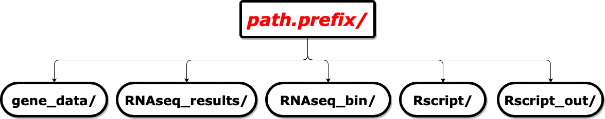{ width=90% }

5. `input.path.prefix` : Path prefix of *'input_files/'* directory. User have to prepare an *'input_file/'* directory with the following rules:
    * **`genome.name`.fa**: reference genome in FASTA file formation.

    * **`genome.name`.gtf**: gene annotation in GTF file formation.
    
    * **raw_fastq.gz/**: directory storing `FASTQ` files. 
        
        * Support paired-end reads files only.
        
        * Names of paired-end `FASTQ` files : '`sample.pattern`_1.fastq.gz' and '`sample.pattern`_2.fastq.gz'. `sample.pattern` must be distinct for each sample.
        
    * **phenodata.csv**: information about RNA-Seq experiment design.
    
        * First column : Distinct ids for each sample. Value of each sample of this column must match `sample.pattern` in `FASTQ` files in *'raw_fastq.gz/'*. Column names must be **ids**.
        
        * Second column : independent variable for the RNA-Seq experiment. Value of each sample of this column can only be parameter `case.group` and `control.group`. Column name is parameter `independent.variable`.
        
    * **indices/** : directory storing `HT2` indices files for HISAT2 alignment tool. 
    
        * This directory is **optional**. `HT2` indices files corresponding to target reference genome can be installed at [HISAT2 official website](https://ccb.jhu.edu/software/hisat2/index.shtml). Providing `HT2` files can accelerate the subsequent steps. It is highly advised to install `HT2` files.
        
        * If `HT2` index files are not provided, *'input_files/indices/'* directory should be deleted.
        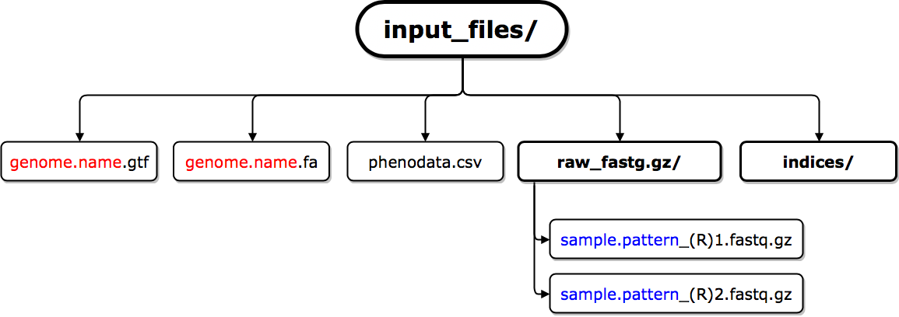{ width=110% }

6. `genome.name` : Variable of genome name defined in this RNA-Seq workflow (ex. '`genome.name`.fa', '`genome.name`.gtf')  

7. `sample.pattern` : Regular expression of paired-end fastq.gz files under *'input_files/raw_fastq.gz/'*. **IMPORTANT!!** Expression shouldn't have `_[1,2].fastq.gz` in end.

8. `independent.variable`: Independent variable for the biological experiment design of two-group RNA-Seq workflow.

9. `case.group` : Group name of the case group.

10. `control.group` : Group name of the control group.

11. `indices.optional` : logical value whether *'input_files/indices/'* is exit. Value is `TRUE` or `FALSE`

## `RNASeqWorkFlowParam` Constructor Checking Steps

1. Create a new directory for RNA-Seq analysis. It is highly recommended to create a new directory without any files inside. The parameter `path.prefix` of `RNASeqWorkFlowParam()` constructor should be the absolute path of this new directory. All the RNA-Seq related files that generated in the following steps will be stored inside of this directory.

2. Create valid *'input_files/'* directory. You should create a file directory named *'input_files/'* with neccessary files inside. It should follow the rules metioned above.
    
3. Run constructor of `RNASeqWorkFlowParam` S4 object. This constructor will check the validity of input parameters before creating S4 objects.
    * Operating system
    
    * Python version
    
    * 2to3 command  
    
    * Structure, contents and rules of *'inputfiles/'*
    
    * Validity of input parameters

## Example

```{r, warning=FALSE}
library(RNASeqWorkflow)
library(RNASeqWorkflowData)
```
```{r}
input_files.path <- system.file("extdata/", package = "RNASeqWorkflowData")
rnaseq_result.path <- "/tmp/yeast_example/"
dir.create(rnaseq_result.path)
list.files(input_files.path, recursive = TRUE)
```

Check the files in *'inputfiles/'* directory.

```{r, warning=FALSE}
exp <- RNASeqWorkflowParam(path.prefix = rnaseq_result.path, 
                           input.path.prefix = input_files.path, 
                           genome.name = "Saccharomyces_cerevisiae_XV_Ensembl", 
                           sample.pattern = "SRR[0-9]*_XV",
                           independent.variable = "state", 
                           case.group = "60mins_ID20_amphotericin_B", 
                           control.group = "60mins_ID20_control")
```

In this example, `RNASeqWorkFlowParam` S4 object is store in `exp` for subsequent RNA-Seq analysis steps. Any ERROR occured in checking steps will terminate the program.

# Environment Setup

This is the **first necessary step** of RNA-Seq workflow in this package. To set up the environment, run `RNASeqEnvironmentSet_CMD()` to execute process in background or run `RNASeqEnvironmentSet()` to execute process in R shell.

## Files Setup

1. Create Base Directories. *'gene_data/'*, *'RNASeq_bin/'*, *'RNASeq_results'*, *'Rscript'* and *'Rscript_out'* will be created under `path.prefix` directory. Here are the usage of these five main directories: 
    * *'gene_data/'*: Symblic links of *'input_files/'* and files that are created in each step of RNA-Seq analysis will be stored in this directory. 
    
    * *'RNASeq_bin/'*: The binaries of necessary tools, HISAT2, SAMtools, StringTie and Gffcompare, are installed in this directory.
    
    * *'RNASeq_results'*: The RNA-Seq results, for example, alignment results, quality assessment results, differential analysis results etc., will be stored in this directory.
    
    * *'Rscript'*: If your run `XXX_CMD()` function, corresponding R script(`XXX.R`) for certain step will be created in the directory.
    
    * *'Rscript_out'*: The corresponding output report for R script(`XXX.Rout`) will be stored in this directory.

2. Symbolic links will be created from files in *'input_files/'* to `path.prefix` directory. 

## Necessary Tools Installation

The operating system of your workstation will be detected. If the operating system is other than `Linux` and `macOS`, ERROR will be reported. You can choose whether you want to install programs automatically or not. Four programs, HISAT2, SAMtools, StringTie and Gffcompare, are necessary for the following analysis workflow. In `RNASeqEnvironmentSet_CMD()` and `RNASeqEnvironmentSet()` functions, there are four parameters, `install.hisat2`, `install.stringtie`, `install.gffcompare`, and `install.samtools`, that you can set to determin whether particular softwares are going to be installed automatically or not. Defualt values are `TRUE` and these four programs will be installed by default. If you want to skip the installation process of particular program, you can set the parameter value to `FALSE`. But please make sure that the program you skipped in installation process is available by running `system2()` through R shell. Availability of these commands will be checked at the end of this environment setup function. Any unavailability of the commands will cause fail in 'Environment Setup' step.

If the parameter values are `TRUE`, these four tools will be installed:

* HISAT2
    * Based on your operating system, `hisat2-2.1.0-Linux_x86_64.zip` or `hisat2-2.1.0-OSX_x86_64.zip` zipped file will be installed.
    
    * Installed file will be unzipped and all binary files will be copied under *'RNASeq_bin/'*
    
* SAMtools
    * `samtools-1.8.tar.bz2` source files will be installed. 
    
    * Installed files will be unzipped and compiled. If there is any ERROR occurred during compilation, program will be stopped. You should check whether the development environment is OK for SAMtools before rerunning `RNASeqEnvironmentSet_CMD` or `RNASeqEnvironmentSet()` to set up the environment again.
    
    * Maked SAMtools binary will be copied under *'RNASeq_bin/'*.
    
* StringTie
    * Based on your operating system, `stringtie-1.3.4d.Linux_x86_64.tar.gz` or `stringtie-1.3.4d.Linux_x86_64` zipped file will be installed.
    
    * Installed file will be unzipped and all binary files will be copied under *'RNASeq_bin/'*.
    
* Gffcompare
    * Based on your operating system, `gffcompare-0.10.4.Linux_x86_64.tar.gz` or `gffcompare-0.10.4.Linux_x86_64.tar.gz` zipped file will be installed.
    
    * Installed file will be unzipped and all binary files will be copied under *'RNASeq_bin/'*.

## Export Path

*'RNASeq_bin/'* will be added to R PATH so that these binaries can be found in R environment. In the last step of environment setting, `hisat2 --version`,`stringtie --version`,`gffcompare --version`,`samtools --version` commands will be checked in order to make sure the environment is correctly constructed.

## Example

Run `RNASeqEnvironmentSet_CMD()` or `RNASeqEnvironmentSet()`. 

1. Run in background
Result will be reported in *'Rscript_out/Environment_Set.Rout'*. Make sure the environment is successfully set up before running the subsequent steps.

```{r, eval=FALSE}
RNASeqEnvironmentSet_CMD(exp)
```

2. Run in R shell 
Result will be reported in R shell. Make sure the environment is successfully set up before running the subsequent steps.

```{r, warning=FALSE, eval=FALSE}
RNASeqEnvironmentSet(exp@path.prefix,
                     exp@input.path.prefix,
                     exp@genome.name,
                     exp@sample.pattern,
                     exp@indices.optional,
                     exp@os.type)
```

# Quality Assessment of `FASTQ` sequence data

This is an **optional step** of RNA-Seq workflow in this package. However, it is strongly recommended to do it before processing reads. To assess the quality of raw reads in `FASTQ` files, run `RNASeqQualityAssessment_CMD()` to execute process in background or run `RNASeqQualityAssessment()` to execute process in R shell.

## "systemPipeR" Quality Assessment

In this process, [systemPipeR](http://bioconductor.org/packages/release/bioc/html/systemPipeR.html) package is used for quality assessment. Here are the following steps:

1. Check the number of times that user has run quality assessment process and create the corresponding files *'RNASeq_results/QA_results/QA_{times}'*.

2. RNA-Seq environment set up. *'rnaseq/'* directory will be created by [systemPipeR](http://bioconductor.org/packages/release/bioc/html/systemPipeR.html) package.

3. Create *'data.list.txt'* file. 

4. Reading `FASTQ` files and create *'fastqReport.pdf'* as the report result of quality assessment

5. Remove *'rnaseq/'* directory.

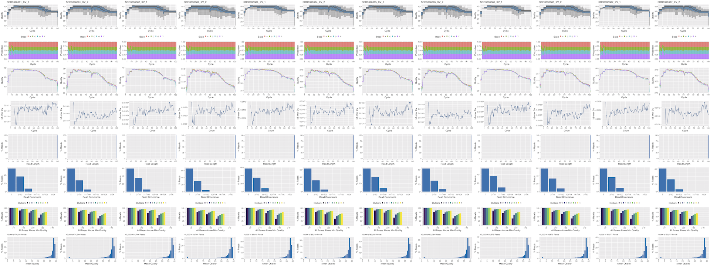{ width=150% }

This quality assessment result is generated by [systemPipeR](http://bioconductor.org/packages/release/bioc/html/systemPipeR.html) package. It will be stored as `PDF`.

## Example

Run `RNASeqQualityAssessment_CMD()` or `RNASeqQualityAssessment()`. 

1. Run in background
Result will be reported in *'Rscriptout/Quality_Assessment.Rout'*. Make sure quality assessment is successfully done before running the subsequent steps.

```{r, eval=FALSE}
RNASeqQualityAssessment_CMD(exp)
```

2. Run in R shell 
Result will be reported in R shell. Make sure quality assessment is successfully done before running the subsequent steps.

```{r, warning=FALSE, eval=FALSE}
RNASeqQualityAssessment(exp@path.prefix,
                        exp@input.path.prefix,
                        exp@sample.pattern)
```

# Quality Trimming of `FASTQ` sequence data

This is an **optional step** of RNA-Seq workflow in this package. However, it is recommended to do it if the result of quality assessment is unsatisfied. To trim the raw reads in `FASTQ` files, run `RNASeqQualityTrimming_CMD()` to execute process in background or run `RNASeqQualityTrimming()` to execute process in R shell. After trimming process, it is strongly recommended to redo quality assessment step. Different quality assessment result will be stored in different directories with index of processing order.

## "ShortRead" Quality Trimming

In this process, [ShortRead](http://bioconductor.org/packages/release/bioc/html/ShortRead.html) package is used for quality trimming. Followings are trimming steps and method explanation.

1. `FASTQ` files with `sample.pattern` in *'gene_data/raw_fastq.gz'* will be listed and be check. This trimming function only support paired-end `FASTQ` files.

2. The probability of error per each base pair is calculated by Phred Quality in `FASTQ` files and the cumulative probability of error of each base pair will also be calculated. The threshold cumulative probability `cum.error`, with default value `1`, is used to find the trimming point of paired end files.

3. `reads.length.limit`, with default value 36,  determines the minimum base pair length of reads. Length of reads less than `reads.length.limit` will be filtered out.

4. Untrimmed original `FASTQ` files are moved to *'gene_data/raw_fastq.gz/original_untrimmed_fastq.gz'*, and trimmed reads are written to *'gene_data/raw_fastq.gz/'*

5. It is strongly recommended to run `RNASeqQualityAssessment_CMD()` or `RNASeqQualityAssessment()` for quality assessment after quality trimming.

## Example

Run `RNASeqQualityTrimming_CMD()` or `RNASeqQualityTrimming()`. 

1. Run in background
Result will be reported in *'Rscript_out/Quality_Trimming.Rout'*. Make sure quality trimming is successfully done before running the subsequent steps.

```{r, eval=FALSE}
RNASeqQualityTrimming_CMD(exp)
```

2. Run in R shell 
Result will be reported in R shell. Make sure quality assessment is successfully done before running the subsequent steps.

```{r, eval=FALSE}
RNASeqQualityTrimming(exp@path.prefix,
                      exp@sample.pattern)
```

# Reads Alignment and Quantification

This is a **second necessary step** of RNA-Seq workflow in this package. Programs installed in environment setting step, HISAT2, SAMtools, StringTie and Gffcompare, will be executed. To process raw reads `FASTQ` files, run `RNASeqRawReadProcess_CMD()` to execute process in background or run `RNASeqRawReadProcess()` to execute process in R shell. For more details about commands that executed during each reads processing step, please check the reported *'RNASeq_results/COMMAND.txt'*. The process steps are mainly refering to [this paper](https://www.nature.com/articles/nprot.2016.095)(Pertea et al. 2016).

## HISAT2 Index

In pre-step(`RNASeqWorkFlowParam` creation step), *'indices/'* directory is checked and the whether `HT2` indices files are provided is known. If not provided, following commands will be executed:

* Input: '`genome.name`.gtf', '`genome.name`.fa'
* Output: '`genome.name`.ss', '`genome.name`.exon', '`genome.name`_tran.{number}.ht2'

1. `extract_splice_sites.py`, `extract_exons.py` execution
    * These two commands are executed to extract splice-site and exon information from gene annotation file.

2. `hisat2-build` index creation
    * This command build HISAT2 indices files with *`genome.name`.ss* and *`genome.name`.exon* created in the previous step. Be aware that index building step requires a larger amount of memory and longer time than steps, and it might not be possible to run on some personal workstations. It is highly recommended to check the availibility of `HT2` indices files at [HISAT2 official website](https://ccb.jhu.edu/software/hisat2/index.shtml) for your target reference genome beforehands. Install `HT2` indices files will greatly shorten the analysis time.

3. Write *'RNASeq_results/COMMAND.txt'*
    * Shell command that run in this step will be documented into *'RNASeq_results/COMMAND.txt'*.

## HISAT2 Alignment

* Input: '`genome.name`_tran.{number}.ht2', '`sample.pattern`.fastq.gz'
* Output: '`sample.pattern`.sam'

1. `hisat2` command is executed on paired end `FASTQ` files. `SAM` files will be created.
    * `SAM` files are stored in *'gene_data/raw_bam/'*.

2. Write *'RNASeq_results/COMMAND.txt'*
    * Shell command that run in this step will be documented into *'RNASeq_results/COMMAND.txt'*.

## SAMtools `SAM` to `BAM`

* Input: '`sample.pattern`.sam'
* Output: '`sample.pattern`.bam'

1. `samtools` command is executed. Output `SAM` files from HISAT2 will be converted to `BAM` files. 
    * `BAM` files are stored in *'gene_data/raw_sam/'*. 

2. Write *'RNASeq_results/COMMAND.txt'*
    * Shell commands that run in this step will be documented into *'RNASeq_results/COMMAND.txt'*.

## StringTie Assembly

* Input: '`genome.name`.gtf', '`sample.pattern`.bam'
* Output: '`sample.pattern`.gtf'

1. `stringtie` command is executed. 
    * Assembler of RNA-Seq alignments into potential transcripts.
    * Output assembled `GTF` files which are from each `FASTQ` files are stored in *'gene_data/raw_gtf/'*

2. Write *'RNASeq_results/COMMAND.txt'*
    * Shell commands that run in this step will be documented into *'RNASeq_results/COMMAND.txt'*.

## StringTie Merge `GTF`

* Input: '`sample.pattern`.gtf'
* Output: 'stringtiemerged.gtf', 'mergelist.txt'

1. Creating mergelist.txt
    * *gene_data/merged/mergelist.txt* is created for the merging step.
    
2. `stringtie` command is executed. 
    *  Transcript merger merges each *`sample.pattern`.gtf* into *stringtiemerged.gtf*
    *  Output files are all stored in *'gene_data/merged/'*

3. Write *'RNASeq_results/COMMAND.txt'*
    * Shell commands that run in this step will be documented into *'RNASeq_results/COMMAND.txt'*.

## Gffcompare

* Input: '`genome.name`.gtf', 'stringtie_merged.gtf'
* Output: 'merged.annotated.gtf', 'merged.loci', 'merged.stats', 'merged.stringtie_merged.gtf.refmap', 'merged.stringtie_merged.gtf.tmap', 'merged.tracking'

1. `gffcompare` command is executed. 
    * The comparison result of merged `GTF` file and reference annotation file is reported under *'merged/'* directory.

2. Write *'RNASeq_results/COMMAND.txt'*
    * Shell commands that run in this step will be documented into *'RNASeq_results/COMMAND.txt'*.

## StringTie Creates Ballgown Input Directories

* Input: 'stringtie_merged.gtf'
* Output: 'ballgown/', 'gene_abundance/'

1. `stringtie` command is executed.
    * StringTie will create the input directory for ballgown package for the following differential analysis. Ballgown-related files will be stored by each sample name in *'gene_data/ballgown/'*.
    * StringTie will store gene-related information in `TSV` file by each sample name in *'gene_data/gene_abundance/'*.

2. Write *'RNASeq_results/COMMAND.txt'*
    * Shell commands that run in this step will be documented into *'RNASeq_results/COMMAND.txt'*.

## Raw Reads Count Table Creation

Whether this step is executed depends on the availability of Python on your workstation. 

* Input: 'samplelst.txt'
* Output: 'gene_count_matrix.csv', 'transcript_count_matrix.csv'

1. Reads count table converter Python script is downloaded as `prepDE.py`

2. Python checking
    * If Python is not available, this step is skipped.
    
    * If Python2 is available, `prepDE.py` is executed.
    
    * If Python3 is available, `2to3` command will be checked.(Usally, if Python3 is installed, `2to3` command will be installed too.)
    
    * If Python3 is available but `2to3` command is unavailable, raw reads count generation step will be skipped.
    
    * If Python3 and `2to3` command is available, `prepDE.py` is converted to file that can be executed by Python2 and be executed.
    
3. raw reads count creation
    * Raw reads count is created and the results are stored in *'gene_data/reads_count_matrix/'*

4. Write *'RNASeq_results/COMMAND.txt'*
    * Shell commands that run in this step will be documented into *'RNASeq_results/COMMAND.txt'*.

## Example

Run `RNASeqReadProcess_CMD()` or `RNASeqReadProcess()`. 

1. Run in background
Result will be reported in *'Rscriptout/Raw_Read_Process.Rout'*. Make sure raw read process is successfully done before running the subsequent steps.

```{r, eval=FALSE}
RNASeqReadProcess_CMD(exp)
```

2. Run in R shell 
Result will be reported in R shell. Make sure raw read process is successfully done before running the subsequent steps.
```{r, warning=FALSE, eval=FALSE}
python.variable <- "@"(exp, python.variable)
python.variable.answer <- python.variable$check.answer
python.variable.version <- python.variable$python.version
RNASeqReadProcess(exp@path.prefix,
                  exp@input.path.prefix,
                  exp@genome.name,
                  exp@sample.pattern,
                  python.variable.answer,
                  python.variable.version,
                  exp@python.2to3,
                  num.parallel.threads = 10,
                  exp@indices.optional)
```

# Gene-level Differential Analyses

This is the **third necessary step** of RNA-Seq workflow in this package. To do differential expression analysis, run `RNASeqDifferentialAnalysis_CMD()` to execute process in background or run `RNASeqDifferentialAnalysis()` to execute process in R shell. In `RNASeqWorkflow` package, we provide four ways to do differential expression analysis: ballgown, TPM & Student t-test, DESeq2 and edgeR. Gene ids reported by StringTie(raw reads count) and ballgown(result) will be mapped to 'gene_name' provided in `GTF` file. 'gene_name' will be used to do gene functional analysis and pathway analysis in the next step.(!!!Functional 還有一些問題～ 這週要和學姊討論一下!!!)

## Alignment Report

If you run `RNASeqRawReadProcess_CMD()` in the previous step, *'Rscript_out/Read_Process.Rout'* will be created and in the beginning of this step, alignment results, a`CSV` file and a `PNG` file, will be reported based on *'Rscript_out/Read_Process.Rout'* file. 

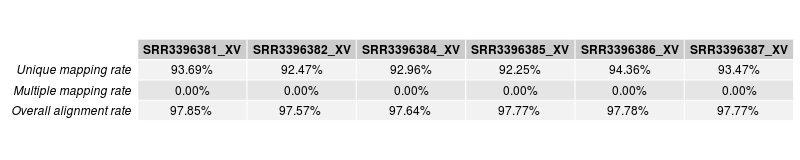{ width=120% }

## General Visualization

'ballgown', 'TPM & Student t-test', 'DESeq2' and 'edgeR' will be processed in order in this step. After doing differential expression analysis, results of each method will be visualized and stored in *'RNASeq_results/'*. The pictures showed in the following steps are the visualization result of data in `RNASeqWorkflowData` experiment package. The detail steps and the method-specific plots in each method will be discussed sperately later. Here we focus on the some general plots that will be created and stored in the directories of these four differential analysis tools. We only show DESeq2 result plots as an example. The following are the general plots(DESeq2): 

* Pre differential analysis sample profile related plot:
    * Frequency Plots:
        * *'Frequency_Plot_normalized_count_ggplot2.png'*
            The frequency of normalized reads count(In DESeq2 is **MRN**). The range of x axis(**MRN**) is from 0% of data minus 20(smallest **MRN** values - 20) to 90% of data plus 20. It is drawn by [ggplot2](https://cran.r-project.org/web/packages/ggplot2/index.html).
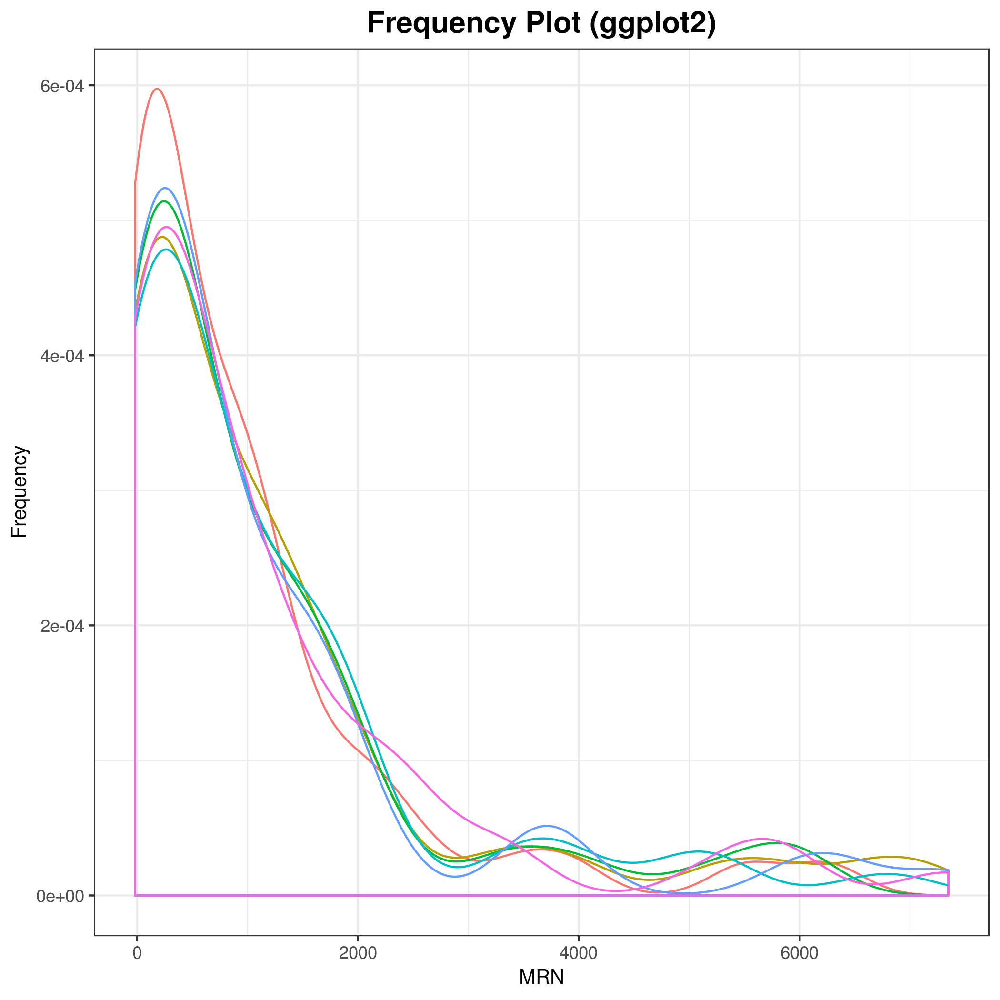{ width=120% }

        * *'Frequency_Plot_log_normalized_count_ggplot2.png'* 
            The frequency of log base two of normalized reads count plus one(in DESeq2 is **log<sub>2</sub>(MRN+1)**). The range of x axis(**log<sub>2</sub>(MRN+1)**) is from 0% of data minus 5(smallest **log<sub>2</sub>(MRN+1)** - 5) to 99% of data plus 5. It is drawn by [ggplot2](https://cran.r-project.org/web/packages/ggplot2/index.html).
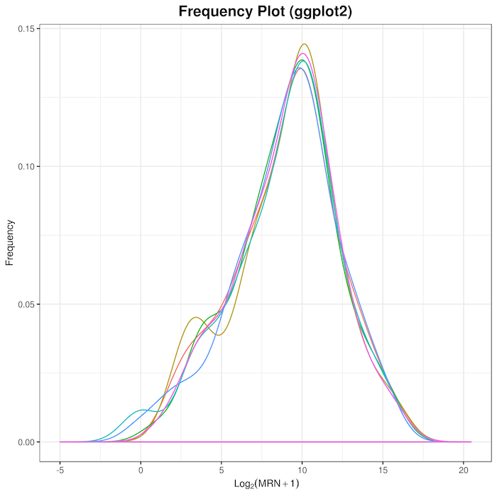{ width=120% }

    * Distribution Plots:
        * *'Box_Plot_ggplot2.png'*
            The distribution of log base two of normalized reads count plus one(in DESeq2 is **log<sub>2</sub>(MRN+1)**) depicting groups of numerical . Case is on left-hand side in turquoise and control is on right-hand side in yellow. It is drawn by [ggplot2](https://cran.r-project.org/web/packages/ggplot2/index.html).
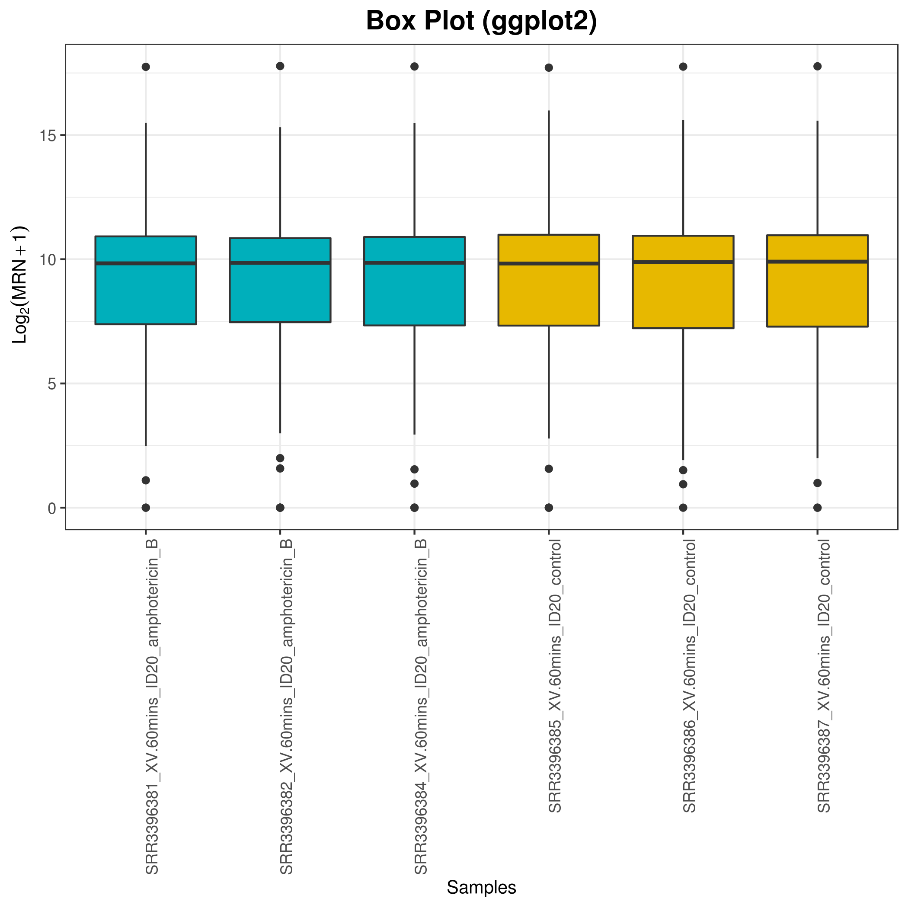{ width=120% }

        * *'Violin_Plot_ggplot2.png'*
            The distribution of log base two of normalized reads count plus one(in DESeq2 is **log<sub>2</sub>(MRN+1)**) of each sample. Case is on left-hand side in green and control is on right-hand side in yellow. It is drawn by [ggplot2](https://cran.r-project.org/web/packages/ggplot2/index.html).
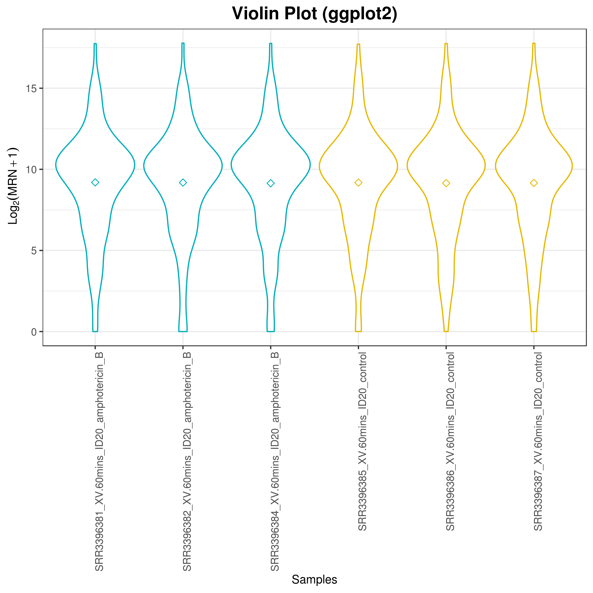{ width=120% }
    
    * PCA Plots:
        In principal component analysis(PCA) test before differential expression analysis, we use [FactoMineR](https://cran.r-project.org/web/packages/FactoMineR/index.html) package to calculate principal component scores and [factoextra](https://cran.r-project.org/web/packages/factoextra/index.html) to extract and visualize the results of principal component scores. Three plots are provided.
        * *'Dimension_PCA_Plot_factoextra.png'*
            Percentage of explained variances in top five dimensions are plotted. The top two percentage of explained variance will be used to plot PCA plot.
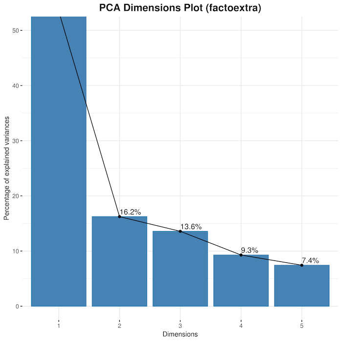{ width=120% }

        * *'PCA_Plot_factoextra.png'*
            This PCA plot is drawn by `fviz_pca_ind()` function in [factoextra](https://cran.r-project.org/web/packages/factoextra/index.html). Case group is in green and control group is in yellow. The smaller points represent the individual samples and the bigger points represent the average of case group samples and control group samples. Ellipses will be added for case and control group samples.
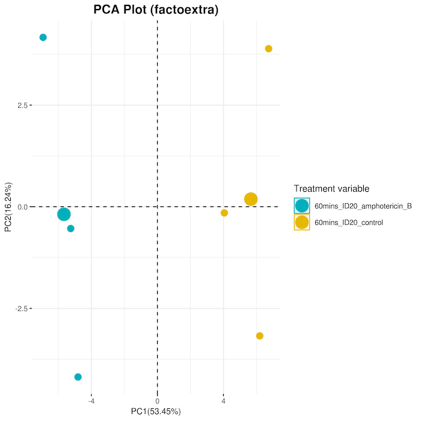{ width=120% }

        * *'PCA_Plot_ggplot2.png'*
            This PCA plot is drawn directly by [ggplot2](https://cran.r-project.org/web/packages/ggplot2/index.html) with principal component scores calculated by [FactoMineR](https://cran.r-project.org/web/packages/FactoMineR/index.html) package. Case group is in green and control group is in yellow.
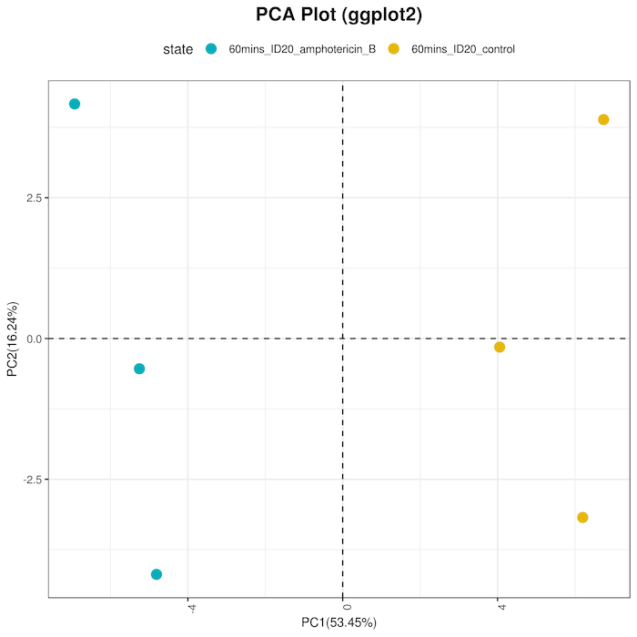{ width=120% }

    * Correlation Plot : 
        * *'Correlation_Heat_Plot_ggplot2.png'*
            Correlations between each pair of samples is calculated by using [R Stats](https://stat.ethz.ch/R-manual/R-devel/library/stats/html/00Index.html#S) package and drawn by [ggplot2](https://cran.r-project.org/web/packages/ggplot2/index.html). Maximum correlation(1) is in red and minimum correlation in all sample pairs is in blue. 
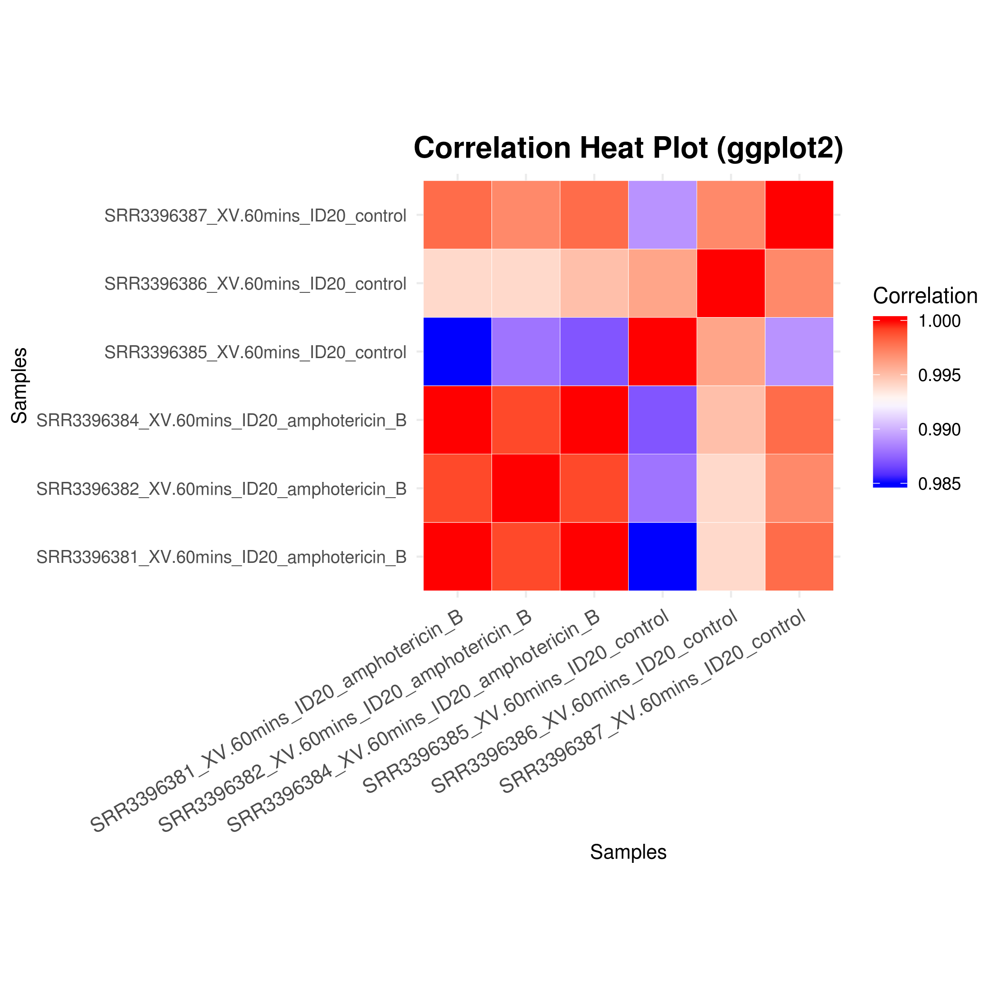{ width=120% }

        * *'Correlation_Dot_Plot_corrplot.png'*
            Correlation dot plot is drawn by `corrplot()` function in [corrplot](https://cran.r-project.org/web/packages/corrplot/index.html) package. Maximum correlation(1) is in red and minimum correlation in all sample pairs is in blue. 
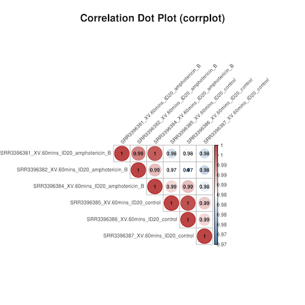{ width=120% }

        * *'Correlation_Bar_Plot_PerformanceAnalytics.png'*
            Correlation bar plot is drawn by `chart.Correlation()` function in [PerformanceAnalytics](https://cran.r-project.org/web/packages/PerformanceAnalytics/index.html) package. 
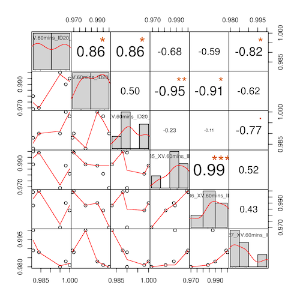{ width=120% }

* Differential analysis related plot
    * Volcano Plot : 
        * *'Volcano_Plot_graphics.png'*
            Volcano plot is drawn by [ggplot2](https://cran.r-project.org/web/packages/ggplot2/index.html). X axis is log base two of fold change(**log<sub>2</sub>(fold change)**); Y axis is negative log base ten of p-value(**log<sub>10</sub>(p-value)**). The upregulated and downregulated genes are colored with red and green.
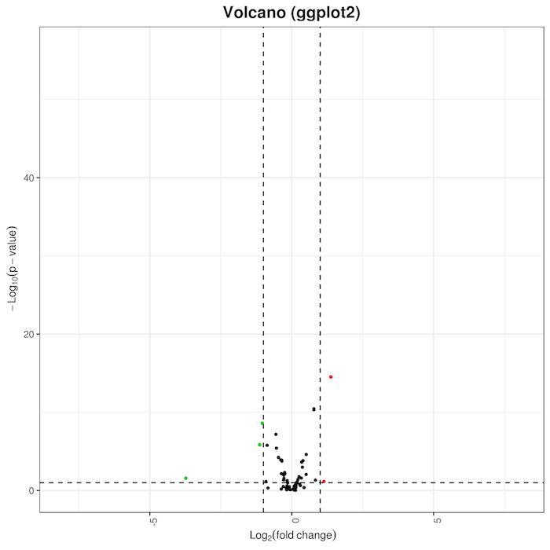{ width=140% }

    * PCA Plot : 
        After differential expression(DE) analysis, principal component analysis is done again. Same as pre-DE PCA, we use [FactoMineR](https://cran.r-project.org/web/packages/FactoMineR/index.html) package to calculate principal component scores and [factoextra](https://cran.r-project.org/web/packages/factoextra/index.html) to extract and visualize the results of principal component scores. Three plots are provided.
        * *'Dimension_PCA_Plot_factoextra.png'*
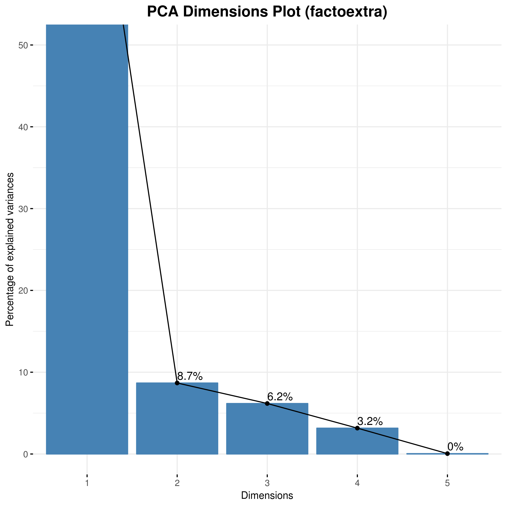{ width=120% }

        * *'PCA_Plot_factoextra.png'*
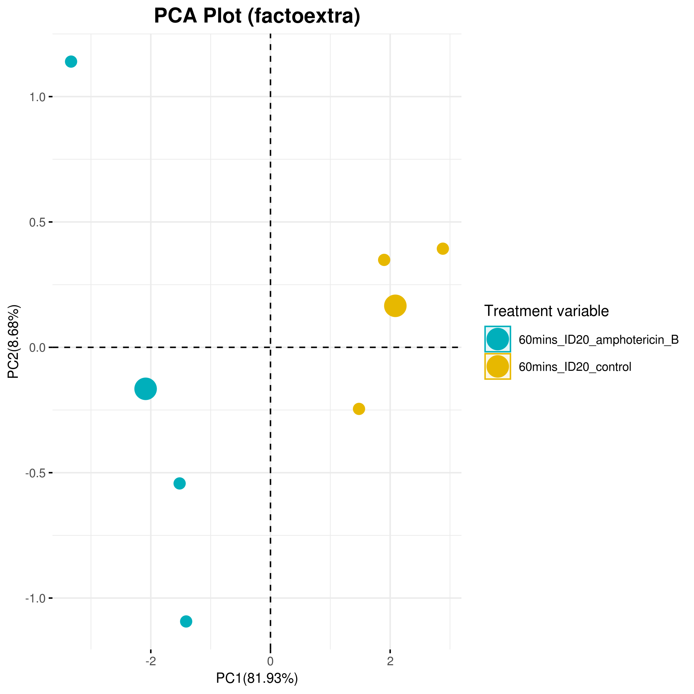{ width=120% }

        * *'PCA_Plot_ggplot2.png'*
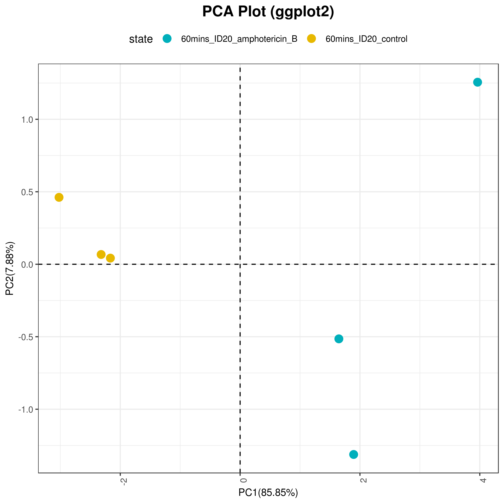{ width=120% }

    * Heatmap Plot :
        * *'Heatmap_Plot_pheatmap.png'* 
            Heatmap is drawn by `pheatmap()` function in [pheatmap](https://cran.r-project.org/web/packages/pheatmap/index.html) package. Log base 2 of normalized count plus one(**log<sub>2</sub>(FPKM+1)** for ballgown) is calculated first. All calculated sample values substract mean of case group sample values(**log<sub>2</sub>(case_mean_FPKM+1) - log<sub>2</sub>(each_FPKM+1)** ) will be used to drawn this heatamp. Case group samples are on the left in green and control group samples are on the right in yellow. 
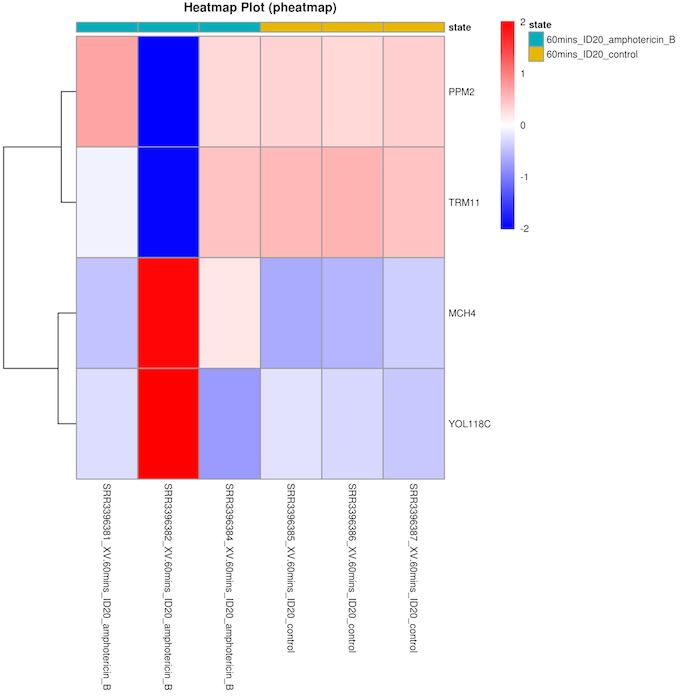{ width=140% }

## "ballgown" Analysis
[Ballgown](https://www.bioconductor.org/packages/release/bioc/html/ballgown.html) is designed to simplify differential expression analysis of RNA-Seq data(more information in [ballgown github](https://github.com/alyssafrazee/ballgown)). The default statistical model is a parametric F-test comparing nested linear models. Normalized row count in [ballgown](https://www.bioconductor.org/packages/release/bioc/html/ballgown.html) is represented as FPKM values. The following are [ballgown](https://www.bioconductor.org/packages/release/bioc/html/ballgown.html) analysis steps:

* Input: *'gene_data/ballgown/'*
* Output: *'RNASeq_results/ballgown_analysis/'*

1. `ballgown` object is created and written in *'RNASeqresults/ballgownanalysis/ballgownRobject/ballgown.rda'*. 

2. The row sum of sample FPKM values equals `0` will be filter out. Moreover, row of extracted statistic results from created ballgown object with `pval` equals `0` or `qval` equals `0` will be filterd out too. Log base two fold change(log<sub>2</sub>(fold change)) value will be calculated as column name `log2FC`. According to the *'gene_data/phenodata.csv'* file, normalized count will be seperated into case and control group with column name *`sample.pattern.FPKM`*.

3. A report `CSV` file combined with normalized FPKM count, average of case group, control group and statistic results will be stored as *'RNASeq_results/ballgown_analysis/ballgown_normalized_result.csv'*.

4. Differential expressed gene result *'RNASeq_results/ballgown_analysis/ballgown_normalized_DE_result.csv'* is reported. Default selecting threshold is **`pval < 0.05` and `log2FC > 1 | log2FC < 1`**.

5. Visualization. The general plots mentioned above and the following plot will be drawn.
    * Transcript Related Plots
        * Distribution Transcript Length Plot
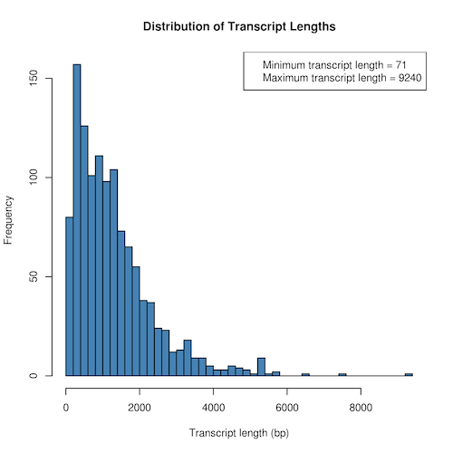{ width=140% }
    
    * Differential analysis related plot
        * MA Plot : 
            The plot visualizes the differences between case and control by transforming the data onto X axis `log2FC` and Y axis `log2(FPKM.mean)`. It is drawn by [ggplot2](https://ggplot2.tidyverse.org) package.
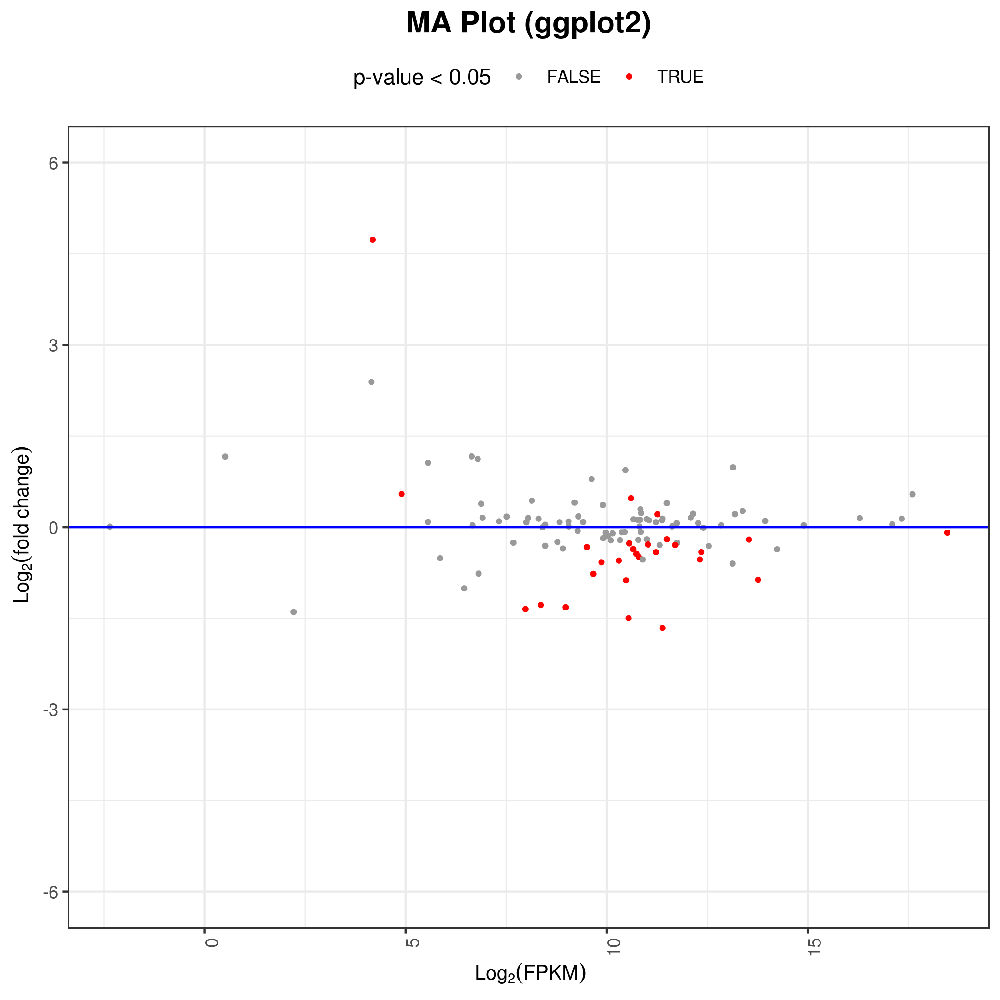{ width=140% }

## TPM & Student t-test Analysis
Normalized count is represented as TPM values. The statistic model used here is Student's t-test. The following are analysis steps:

* Input: *'gene_data/ballgown/'*
* Output: *'RNASeq_results/TPM_analysis/'*

1. Calculate TPM values from [ballgown](https://www.bioconductor.org/packages/release/bioc/html/ballgown.html) FPKM values and save with column name *`sample.pattern.FPKM`* FPKM values.

2. Use Student's t-test to calculate p-value and saved as column name `pval`.

3. Calculate fold change values as dividing average TPM values of control group plus one by average TPM values of case group plus one((Average_case_TPM+1) / (Average_control_TPM+1) ) with column name `fc`. Log base two fold change(log<sub>2</sub>(fold change)) is also calculated and stored as `log2FC`.

4. A report `CSV` file combined with normalized TPM count, average of case group, control group and statistic results will be stored as *'RNASeq_results/TPM_analysis/TPM_normalized_result.csv'*.

5. Differential expressed gene result *'RNASeq_results/TPM_analysis/TPM_normalized_DE_result.csv'* is reported. Default selecting threshold is **`pval < 0.05` and `log2FC > 1 | log2FC < 1`** 

6. Visualization. The general plots mentioned above and the following plot will be drawn.
    * Differential analysis related plot
        * MA Plot : 
            The plot visualizes the differences between case and control by transforming the data onto X axis `log2FC` and Y axis `log2(TPM.mean)`. It is drawn by [ggplot2](https://ggplot2.tidyverse.org) package.
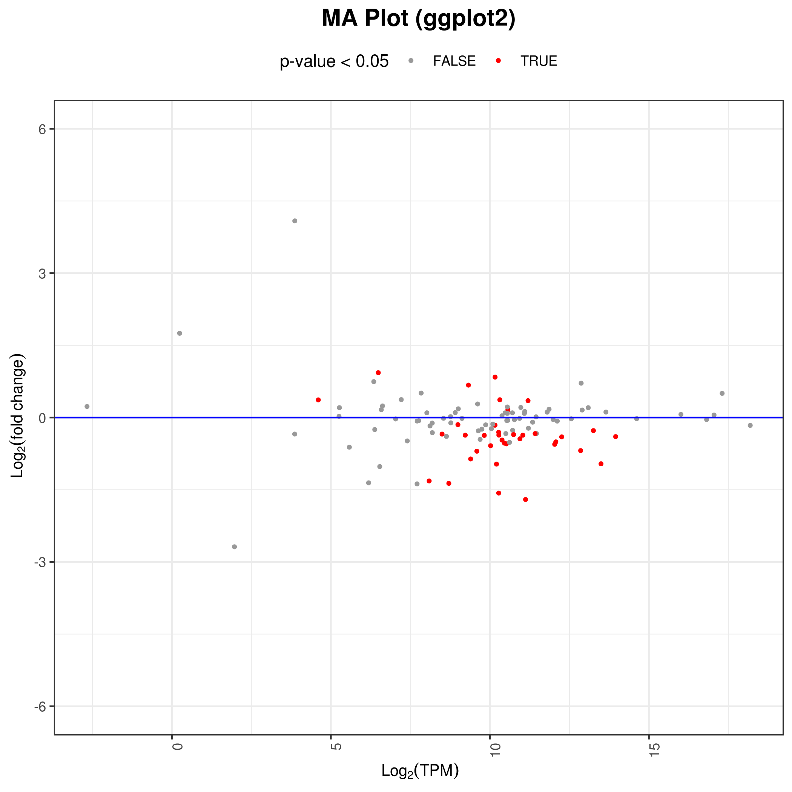{ width=140% }

## "DESeq2" Analysis

[DESeq2](https://bioconductor.org/packages/release/bioc/html/DESeq2.html) estimate variance-mean dependence in raw reads count( more information in[DESeq2 document](https://bioconductor.org/packages/release/bioc/vignettes/DESeq2/inst/doc/DESeq2.html)). The statistic model for differential expression is using negative binomial distribution. DESeq2 package takes sequence depth and RNA composition into consideration and use median of ratios normalization(MRN) method to reads count normalization ([related site](https://hbctraining.github.io/DGE_workshop/lessons/02_DGE_count_normalization.html)). The follwing are the analysis steps.

* Input: *'gene_data/reads_count_matrix/gene_count_matrix.csv'*
    (Row sum of gene raw reads count that equals `o` will be filtered out)
* Output: *'RNASeq_results/ballgown_analysis/'*

1. Create `DESeqDataSet` object from raw reads count of genes by running `DESeqDataSetFromMatrix()` function in DESeq2.

2. Run `DESeq2()` function to do differential expression analysis.

3. A report `CSV` file combined with normalized MRN count, average of case group, control group and statistic results will be stored as *'RNASeq_results/DESeq2_analysis/DESeq2_normalized_result.csv'*.

4. Differential expressed gene result *'RNASeq_results/DESeq2_analysis/DESeq2_normalized_DE_result.csv'* is reported. Default selecting threshold is **`pval < 0.05` and `log2FC > 1 | log2FC < 1`** 

5. Visualization. The general plots mentioned above and the following plots will be drawn.
    * Pre differential analysis sample profile related plot:
        * Dispersion Plot : 
            DESeq2 provides a useful function, `plotDispEsts()`, to plot the dispersion estimates. X axis is `mean of normalized counts`; Y axis is `dispersion`.
{ width=140% }
    
    * Differential analysis related plot
        * MA Plot : 
            The plot visualizes the differences between case and control by transforming the data onto X axis `mean of normalized counts` and Y axis `log fold change`. It is created by `plotMA()` function in [DESeq2](https://bioconductor.org/packages/release/bioc/html/DESeq2.html).
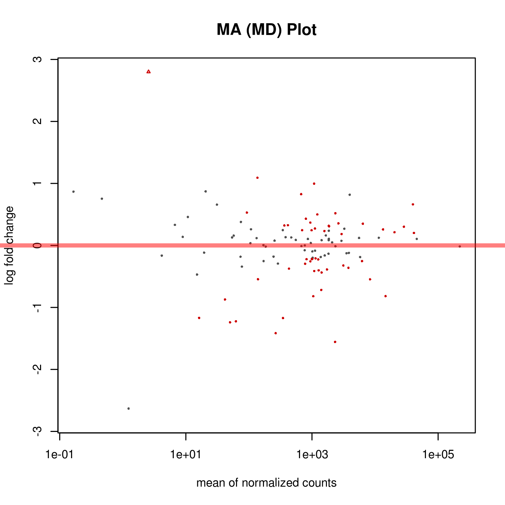{ width=140% }

## "edgeR" Analysis

[edgeR](https://bioconductor.org/packages/release/bioc/html/edgeR.html), a tool for differential expression analysis, implements a range of statistical method based on negative binomial distribution. edgeR package normalizes for RNA composition by finding a set of scaling factors for the library sizes, which is computed by trimmed mean of M-values(TMM). Normalized count is represented as cpm with library size scaled by TMM ([related site](https://bioconductor.org/packages/release/bioc/vignettes/edgeR/inst/doc/edgeRUsersGuide.pdf)). The following are analysis steps:

* Input: *'gene_data/reads_count_matrix/gene_count_matrix.csv'*
    (Row sum of gene raw reads count that equals `o` will be filtered out)
* Output: *'RNASeq_results/edgeR_analysis/'*

1. Create `DEGList` object from raw reads count by running `DGEList()` function.

2. Normalize `DEGList` object with TMM by running `calcNormFactors()` function.

3. Run `estimateCommonDisp()` to maximize the negative binomial conditional common likelihood and then run `estimateTagwiseDisp()` to estimate tagwise dispersion values by an empirical Bayes method.

4. Compute genewise exact tests and get statistic results by running `exactTest()`.

5. Get normalized count by running `cpm()` on TMM scaled `DEGList` object.

6. A report `CSV` file combined with normalized TMM count, average of case group, control group and statistic results will be stored as *'RNASeq_results/edgeR_analysis/edgeR_normalized_result.csv'*.

7. Differential expressed gene result *'RNASeq_results/edgeR_analysis/edgeR_normalized_DE_result.csv'* is reported. Default selecting threshold is **`pval < 0.05` and `log2FC > 1 | log2FC < 1`** 

8. Visualization. The plots mentioned above and the following plots will be drawn.
    * Pre differential analysis sample profile related plot
        * MeanVar Plot
            [edgeR](https://bioconductor.org/packages/release/bioc/html/edgeR.html) provides a useful function `plotMeanVar()` to visualize the mean-variance relationship in `DEGList`. 
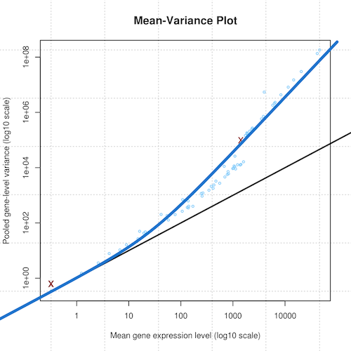{ width=120% }
        
        * BCV Plot
            [edgeR](https://bioconductor.org/packages/release/bioc/html/edgeR.html) provides a useful function `plotBCV()` to plot the genewise biological coefficient of variance(BCV) against gene abundace.
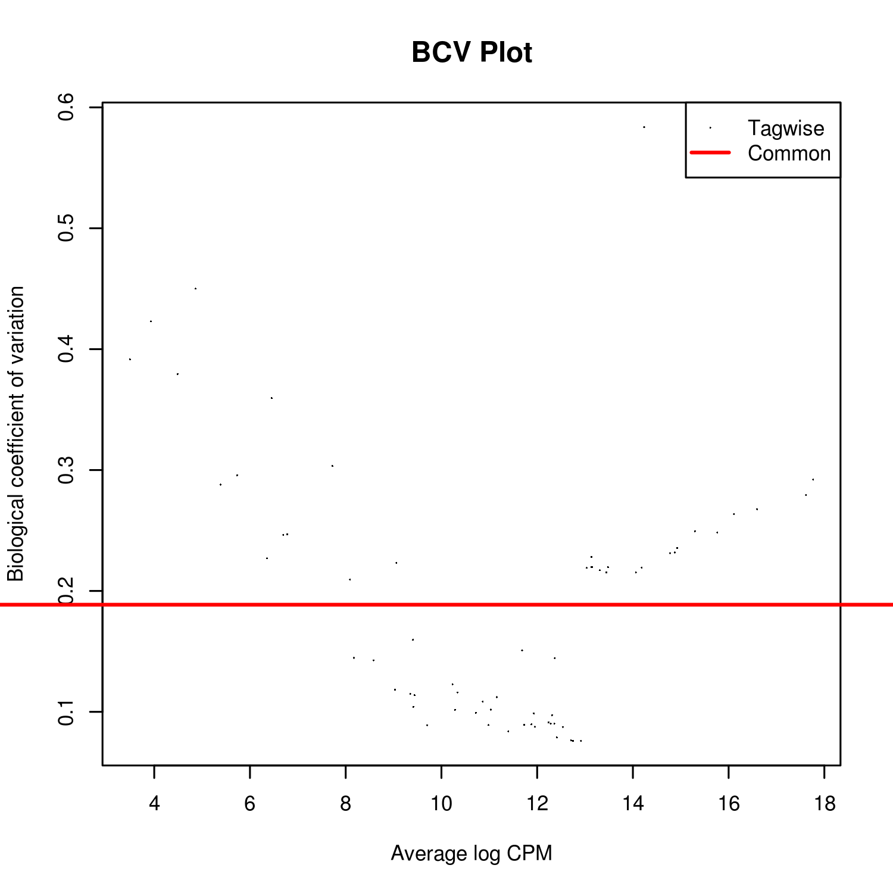{ width=120% }
        
        * MDS Plot
            [edgeR](https://bioconductor.org/packages/release/bioc/html/edgeR.html) provides a useful function `plotMDS.DGEList()` to plot samples on a 2D scatterplot with distances representing expression differences between the samples.
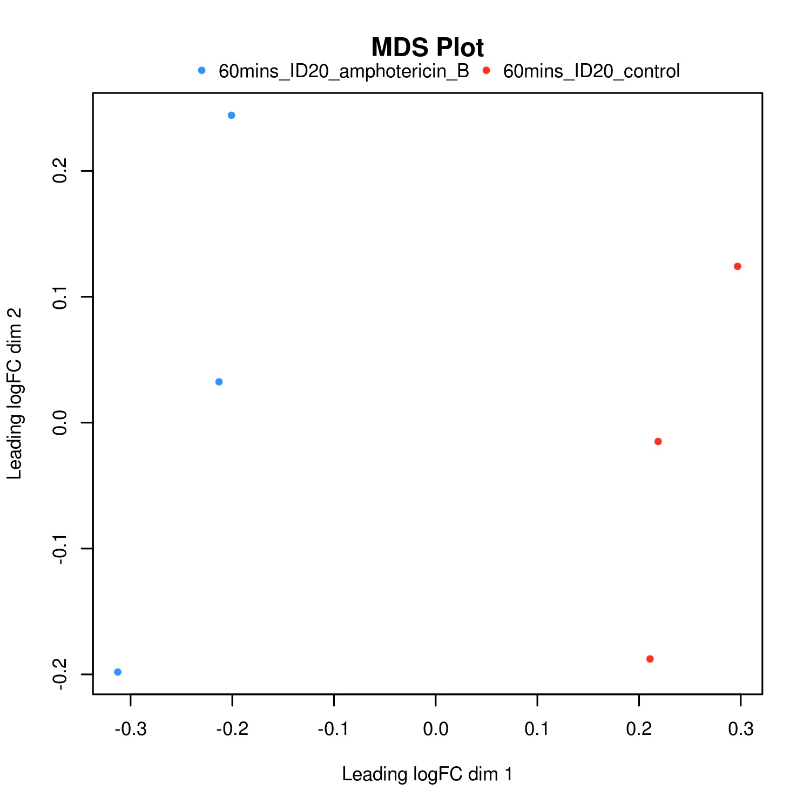{ width=120% }
    
    * Differential analysis related plot
        * Smear Plot
            [edgeR](https://bioconductor.org/packages/release/bioc/html/edgeR.html) provides a useful function `plotSmear()` to plot log base 2 fold change(**log<sub>2</sub>(fold change))**) against the log-concentration.
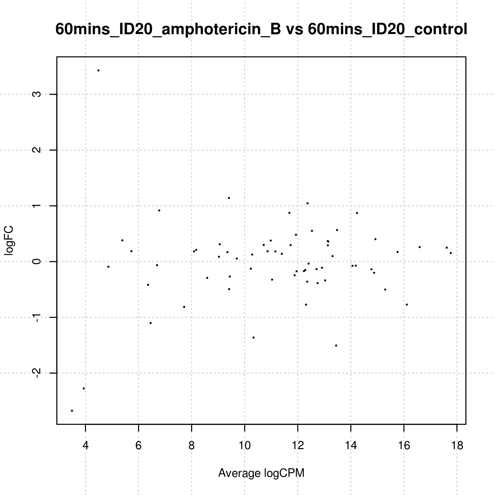{ width=140% }

## Example

Run `RNASeqDifferentialAnalysis_CMD()` or `RNASeqDifferentialAnalysis()`. 

1. Run in background
Result will be reported in *'Rscriptout/Differential_Analysis.Rout'*. Make sure differential expression analysis is successfully finished before running subsequent steps.

```{r, eval=FALSE}
RNASeqDifferentialAnalysis_CMD(exp)
```

2. Run in R shell 
Result will be reported in R shell. Make sure differential expression analysis is successfully finished before running subsequent steps.
```{r, eval=FALSE}
RNASeqDifferentialAnalysis(exp@path.prefix,
                           exp@genome.name,
                           exp@sample.pattern,
                           exp@independent.variable,
                           exp@case.group,
                           exp@control.group,
                           ballgown.pval = 0.05,
                           ballgown.log2FC = 1,
                           TPM.pval = 0.05,
                           TPM.log2FC = 1,
                           DESeq2.pval = 0.1,
                           DESeq2.log2FC = 1,
                           edgeR.pval = 0.05,
                           edgeR.log2FC = 1)
```


# Functional Analysis

This is the **third optional step** of RNA-Seq workflow in this package. [clusterProfiler](https://bioconductor.org/packages/release/bioc/html/clusterProfiler.html) is used in this step. Gene Ontology(GO) functional analysis and Kyoto Encyclopedia of Genes and Genomes(KEGG) pathway analysis are made based on the differential expressed genes(DEG) that are found in four different differential analyses, ballgown, TPM&t-test, DESeq2 and edgeR. Run `RNASeqGoKegg_CMD()` to execute process in background or run `RNASeqGoKegg()` to execute process in R shell.

Users have to provide gene name type, `input.TYPE.ID`, that used in StringTie, ballgown and supported in `OrgDb.species` annotation package for target species. In GO functional analysis and KEGG pathway analysis, `input.TYPE.ID` ID type will be converted into `ENTREZID` ID type by `bitr()` function in clusterProfiler first. Those `input.TYPE.ID` with no corresponding `ENTREZID` will return `NA` and be filtered out. The genes with `Inf` or `-Inf` log2 fold change will be filtered out too. ID conversion will be done in each differential analysis tools, ballgown, TPM & Student's t-test, DESeq2 and edgeR. 

In this example, the RNA-Seq analysis target species is *Saccharomyces cerevisiae*(yeast). The `OrgDb.species` is `org.Sc.sgd.db`; the `input.TYPE.ID` is `GENENAME`. IDs are converted from `GENENAME` to `ENTREZID`.

## Gene Ontology 

Gene Ontology is the framework for the model of biology. It defines the universe of concepts relating to gene functions(GO terms) along three aspects: molecular function(MF), cellular component(CC), biological process(BP), and how these functions are related to each other(relation) ([GO website](http://www.geneontology.org)). In this process, GO gene set enrichment analysis, GO classification and GO over-representation test are implemented by [clusterProfiler](https://bioconductor.org/packages/release/bioc/html/clusterProfiler.html) package.

### GO Classification
The input gene set is differential genes that are reported in each differential expression analysis tools. `groupGO()` function in clusterProfiler is used. Classification result will be stored in `CSV`. The result of classification will be visualized. 15 highest `Counts` functional description will be selected and plotted as bar plot. 

In this example, only the DESeq2 CC GO Classification bar plot is showed.
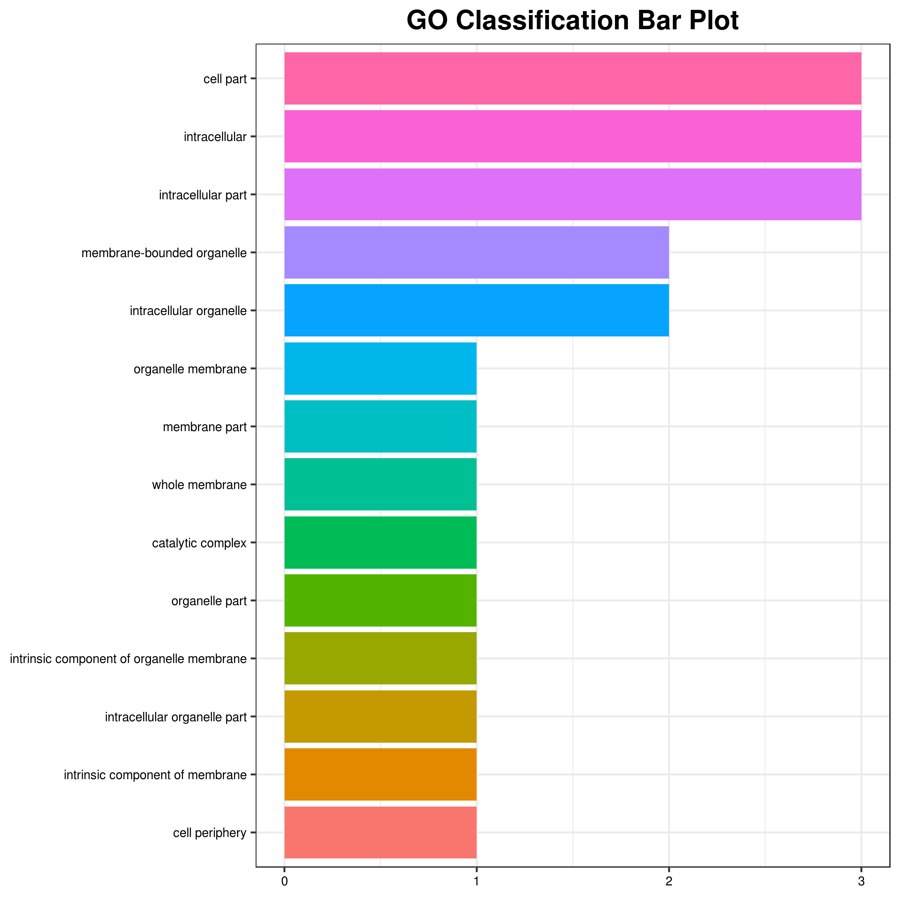{ width=120% }

### GO Over-representation 
The input gene set is differential genes that are reported in each differential analysis tools. `enrichGO()` function in clusterProfiler is used. GO over-representation result will be stored in `CSV`. The result of GO over-representation will be visualized as bar plot and dot plot. 

In this example, only the DESeq2 MF GO Over-representation bar plot and DESeq2 MF GO Over-representation dot plot are showed.
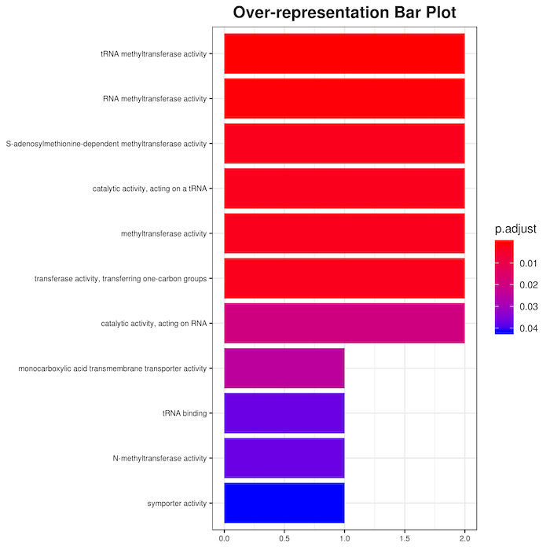{ width=120% }

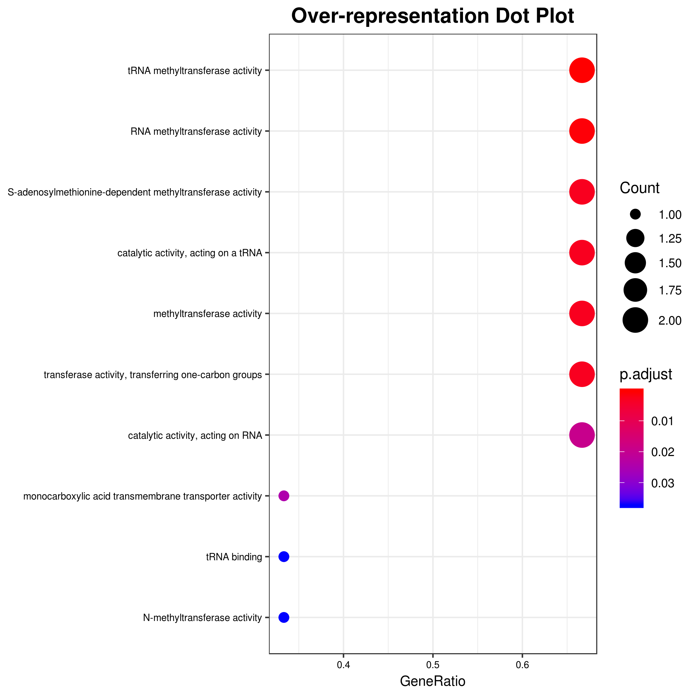{ width=120% }

## Kyoto Encyclopedia of Genes and Genomes
Kyoto Encyclopedia of Genes and Genomes(KEGG) is a database resource for understanding functions and utilities of the biological system from molecular-level information ([KEGG website](https://www.genome.jp/kegg/)). In this process, KEGG gene set enrichment analysis, KEGG over-representation test are implemented by [clusterProfiler](https://bioconductor.org/packages/release/bioc/html/clusterProfiler.html) package.

### KEGG Over-representation
The input gene set is differential genes that are reported in each differential analysis tools. `enrichKEGG()` function in clusterProfiler is used. KEGG over-representation result will be stored in `CSV`. The pathway IDs that found in of KEGG over-representation will be visualized with `pathview` package. KEGG pathway URL will also be stored.

In this example, due to the limited differential expressed genes, no over-represented pathways are found.

## Example
1. Run in background
Result will be reported in *'Rscriptout/GO_KEGG_Analysis.Rout'*. 
```{r, eval = FALSE}
RNASeqGoKegg_CMD(exp, 
                 OrgDb.species = "org.Sc.sgd.db",
                 go.level = 3, 
                 input.TYPE.ID = "GENENAME",
                 KEGG.organism = "sce")
```

2. Run in R shell 
Result will be reported in R shell.
```{r, eval = FALSE}
RNASeqGoKegg(exp@path.prefix, 
             exp@independent.variable, 
             OrgDb.species = "org.Sc.sgd.db", 
             go.level = 3, 
             input.TYPE.ID = "GENENAME",
             KEGG.organism = "sce")
```

# Conlusion


# Session Information
```{r}
sessionInfo()
```

# References

https://www.rna-seqblog.com/introduction-to-rna-sequencing-and-analysis/

https://en.wikipedia.org/wiki/RNA-Seq

Pang CN et al., "Transcriptome and network analyses in Saccharomyces cerevisiae reveal that amphotericin B and lactoferrin synergy disrupt metal homeostasis and stress response.", Sci Rep, 2017 Jan 12;7:40232

Kim D, Langmead B and Salzberg SL. HISAT: a fast spliced aligner with low memory requirements. Nature Methods 2015

Pertea M, Pertea GM, Antonescu CM, Chang TC, Mendell JT & Salzberg SL. StringTie enables improved reconstruction of a transcriptome from RNA-seq reads Nature Biotechnology 2015, doi:10.1038/nbt.3122

Morgan M, Pagès H, Obenchain V, Hayden N (2018). Rsamtools: Binary alignment (BAM), FASTA, variant call (BCF), and tabix file import. R package version 1.32.0, http://bioconductor.org/packages/release/bioc/html/Rsamtools.html.

Mortazavi, A., Williams, B. A., McCue, K., Schaeffer, L., & Wold, B. (2008). Mapping and quantifying mammalian transcriptomes by RNA-Seq. Nature methods, 5(7), 621.

Backman TWH, Girke T (2016). “systemPipeR: NGS workflow and report generation environment.” BMC Bioinformatics, 17(1). doi: 10.1186/s12859-016-1241-0, https://doi.org/10.1186/s12859-016-1241-0.

Morgan M, Anders S, Lawrence M, Aboyoun P, Pagès H, Gentleman R (2009). “ShortRead: a Bioconductor package for input, quality assessment and exploration of high-throughput sequence data.” Bioinformatics, 25, 2607-2608. doi: 10.1093/bioinformatics/btp450, http://dx.doi.org10.1093/bioinformatics/btp450.

Fu J, Frazee AC, Collado-Torres L, Jaffe AE, Leek JT (2018). ballgown: Flexible, isoform-level differential expression analysis. R package version 2.12.0.

Love MI, Huber W, Anders S (2014). “Moderated estimation of fold change and dispersion for RNA-seq data with DESeq2.” Genome Biology, 15, 550. doi: 10.1186/s13059-014-0550-8.

Robinson MD, McCarthy DJ, Smyth GK (2010). “edgeR: a Bioconductor package for differential expression analysis of digital gene expression data.” Bioinformatics, 26(1), 139-140.

McCarthy, J. D, Chen, Yunshun, Smyth, K. G (2012). “Differential expression analysis of multifactor RNA-Seq experiments with respect to biological variation.” Nucleic Acids Research, 40(10), 4288-4297.

Yu G, Wang L, Han Y, He Q (2012). “clusterProfiler: an R package for comparing biological themes among gene clusters.” OMICS: A Journal of Integrative Biology, 16(5), 284-287. doi: 10.1089/omi.2011.0118.

Pertea, M., Kim, D., Pertea, G. M., Leek, J. T., & Salzberg, S. L. (2016). Transcript-level expression analysis of RNA-seq experiments with HISAT, StringTie and Ballgown. Nature protocols, 11(9), 1650.ISO 690

H. Wickham. ggplot2: Elegant Graphics for Data Analysis. Springer-Verlag New York, 2016.


